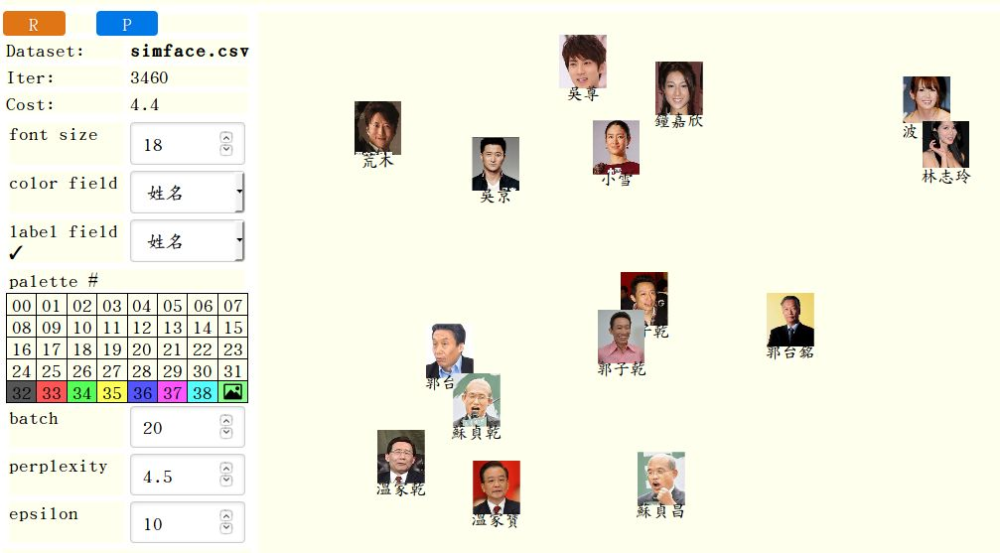

## t-sne-lab: an interactive frontend for t-SNE


中文介紹： [資料科學/機器學習的好用入門工具 t-SNE 幫你看見高維度數值資料](https://newtoypia.blogspot.tw/2017/07/t-sne.html)、
[face\_recognition + t-sne-lab = 撞臉偵測器](https://newtoypia.blogspot.tw/2017/08/facerecognition-t-sne-lab.html)

t-sne-lab is a laboratory for you to interactively explore
a high-dimensional numerical dataset using the t-sne visualization.
It reads a csv file and allows you to choose
which categorical field to be used for color painting,
and which categorical field to be used for labeling the data points.
You can also try different values of the perplexity
and epsilon parameters.
See [digits demo](https://ckhung.github.io/t-sne-lab/t-sne-lab.html?config=digits.json), [letters demo](https://ckhung.github.io/t-sne-lab/t-sne-lab.html?config=letters.json), and [face demo](https://ckhung.github.io/t-sne-lab/t-sne-lab.html?config=lfw.json)

t-sne-lab offers freedom and privacy by letting you download it
and run it offline on your own computer.
Just open the file t-sne-lab.html to see the digits example.
Or you may also specify a different json config file
(e.g. ?config=digits.json) at the end of the URL.
Edit the config file to specify your csv file and other customization values.
The csv file can be either a local file or a remote URL.
Note however that when opening the html page as a local file
(```file:///...```) in a chrome or chromium user,
one has to give the ```--allow-file-access-from-files```
option on the command line when starting the browser,
unless both the configuration file and the
csv data file are both full URL's (including http://localhost/...).
See [this illustration](https://github.com/ckhung/javascriptCanReadLocalFiles)
for more details. Firefox works fine without this complication.

The first row of the csv file must contain the column names.
<del>A column whose name begins with '@'</del>
Columns appearing in the <del>"labelF"</del> "labelCol" array
in the config file can be used as the
coloring and/or the text labeling field.
Columns appearing in the <del>"ignoreF"</del> "ignoreCol" array are ignored.

t-sne-lab can also display picture files instead of colored circles.
One of the columns in the csv file must contain (partial) filenames.
In the config file, "pic.colName" specifies the name of this column.
Additionally, you can specify "pic.prefix" (usually a path/directory)
and "pic.suffix" (usually the file extension such as jpg or png),
which will be prepended and appended, respectively, to the (partial)
filename in order to form the complete path to the picture files.
See [face demo](https://ckhung.github.io/t-sne-lab/t-sne-lab.html?config=lfw.json)
for such an example.
With such configuration, t-sne-lab display the picture files
by default. At any time the user can switch between colored-circle
display mode and picture-file display mode by clicking
the corresponding cell in the palette.

t-sne-lab is a front-end of Andrej Karpathy's
[javascript implementation](https://github.com/karpathy/tsnejs)
of t-SNE.  [t-SNE](https://lvdmaaten.github.io/tsne/)
is a machine-learning algorithm for visualizing
high-dimensional numerical datasets in 2-D or 3-D
invented by Laurens van der Maaten.

Sources of example data files: All data files are manually
edited to add the first row (column names) after said preprocessing.
1. digits.csv: [UCI Machine Learning Repository](https://archive.ics.uci.edu/ml/datasets/Optical+Recognition+of+Handwritten+Digits),
   subsampled: ```perl -ne 's/(.*),(\d+)$/$2,$1/; print if $.%5==1' ~/optdigits.tes > digits.csv```
2. letters.csv: [UCI Machine Learning Repository](https://archive.ics.uci.edu/ml/datasets/Letter+Recognition),
   subsampled: ```perl -ne 'print if $.%20==1' letter-recognition.data > letters.csv```
3. lfw.csv: [Labeled Faces in the Wild](http://vis-www.cs.umass.edu/lfw/), encoded using [face_recognition](https://github.com/ageitgey/face_recognition)
4. ...




