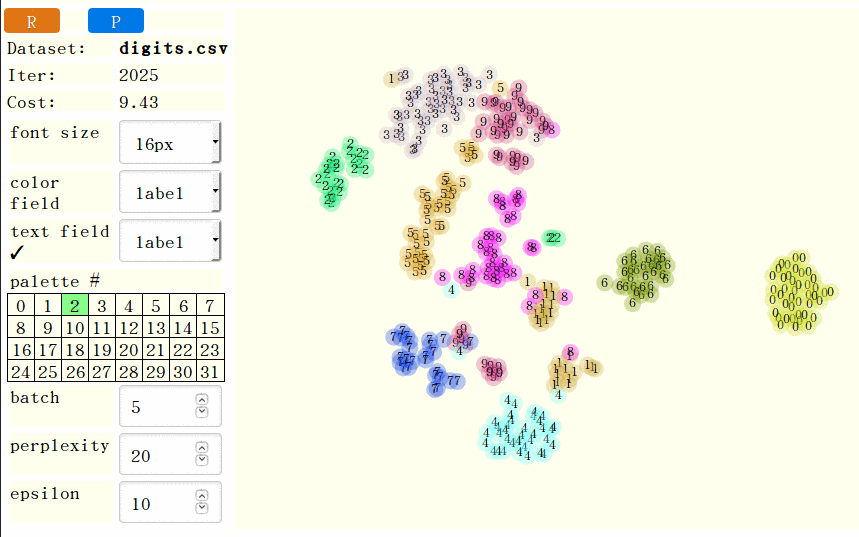

## t-sne-lab: an interactive frontend for t-SNE



中文介紹： [資料科學/機器學習的好用入門工具 t-SNE 幫你看見高維度數值資料](https://newtoypia.blogspot.tw/2017/07/t-sne.html)

t-sne-lab is a laboratory for you to interactively explore
a high-dimensional numerical dataset using the t-sne visualization.
It reads a csv file and allows you to choose
which categorical field to be used for color painting,
and which categorical field to be used for labeling the data points.
You can also try different values of the perplexity
and epsilon parameters.
See [digits demo](https://ckhung.github.io/t-sne-lab/t-sne-lab.html?config=digits.json) and [letters demo](https://ckhung.github.io/t-sne-lab/t-sne-lab.html?config=letters.json).

Specify a json config file (e.g. ?config=digits.json) at the end of the URL.
Edit the config file to specify your csv file and other customization values.
The csv file can be either a local file or an URL.
If the csv file is local, then please see
[this illustration](https://github.com/ckhung/javascriptCanReadLocalFiles)
for how to use t-sne-lab in Chrome. Firefox is fine.
The first row of the csv file must contain the column names.
<del>A column whose name begins with '@'</del>
Fields appearing in the "labelF" array in the config file
can be used as the coloring and/or the text labeling field.
Fields appearing in the "ignoreF" array are ignored.

t-sne-lab is a front-end of Andrej Karpathy's
[javascript implementation](https://github.com/karpathy/tsnejs)
of t-SNE.  [t-SNE](https://lvdmaaten.github.io/tsne/)
is a machine-learning algorithm for visualizing
high-dimensional numerical datasets in 2-D or 3-D
invented by Laurens van der Maaten.

Sources of example data files: All data files are manually
edited to add the first row (column names) after said preprocessing.
1. digits.csv: [UCI Machine Learning Repository](https://archive.ics.uci.edu/ml/datasets/Optical+Recognition+of+Handwritten+Digits),
   subsampled: ```perl -ne 's/(.*),(\d+)$/$2,$1/; print if $.%5==1' ~/optdigits.tes > digits.csv```
2. letters.csv: [UCI Machine Learning Repository](https://archive.ics.uci.edu/ml/datasets/Letter+Recognition),
   subsampled: ```perl -ne 'print if $.%20==1' letter-recognition.data > letters.csv```
3. ...
